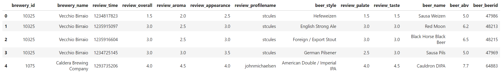
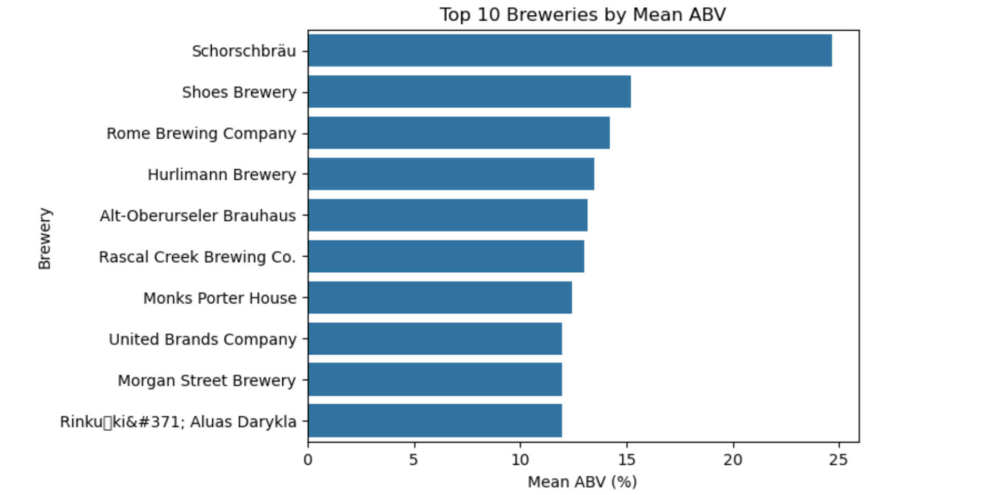
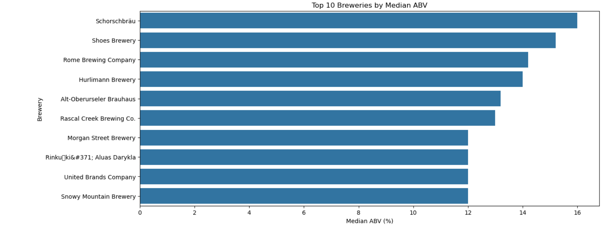
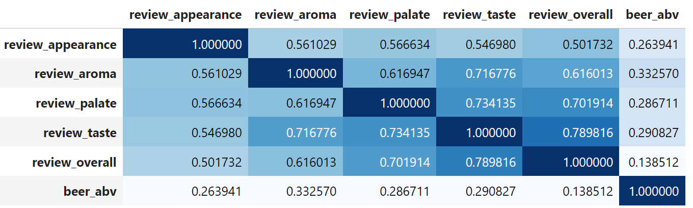
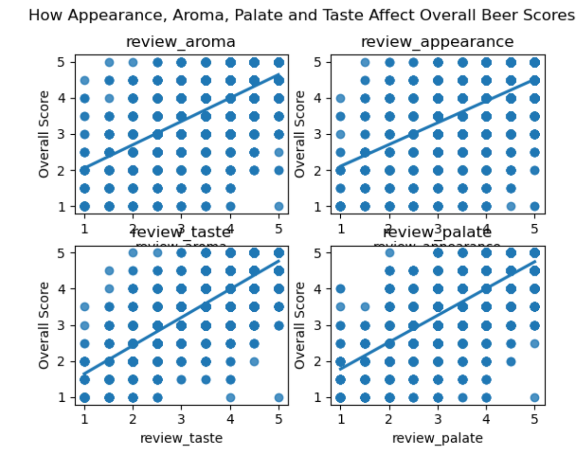
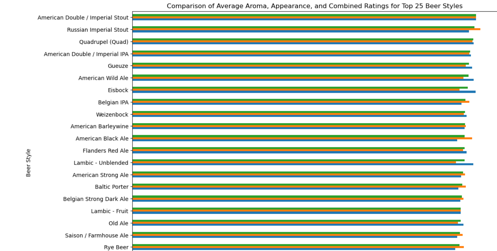

# SchneiderElectricFIO-DA

**Overview**

This project involves the analysis of the **Beer Reviews** dataset,
which includes over 1.5 million reviews of various beers from different
breweries. The dataset is used to answer several analytical questions
related to beer quality, brewery performance, and recommendations based
on various factors such as alcohol by volume (ABV), aroma, taste, and
appearance.

You can download the dataset flow following link https://data.world/socialmediadata/beeradvocate

**Dataset Information**

-   **Dataset Name**: beer_reviews.csv

-   **Total Entries**: 1,586,614
    

-   **Columns**:

    -   brewery_id: Identifier for the brewery.

    -   brewery_name: Name of the brewery.

    -   review_time: Time for the review.

    -   review_overall: Overall score given by the reviewer.

    -   review_aroma: Aroma score given by the reviewer.

    -   review_appearance: Appearance score given by the reviewer.

    -   review_profilename: Username of the reviewer.

    -   beer_style: Style of the beer.

    -   review_palate: Palate score given by the reviewer.

    -   review_taste: Taste score given by the reviewer.

    -   beer_name: Name of the beer.

    -   beer_abv: Alcohol by volume of the beer.

    -   beer_beerid: Identifier for the beer.

**Exploratory Data Analysis (EDA)**

1.  **Data Loading & Initial Overview**:

    -   The dataset was loaded into a Pandas DataFrame, and the first
        few rows were displayed to verify successful loading and get an
        initial preview of the data.

2.  **Data Type Conversion**:

    -   The object-type columns brewery_name, review_profilename,
        beer_style, and beer_name were converted to the categorical type
        for more efficient memory usage and analysis.

3.  **Missing Values**:

    -   A check for null values was conducted, revealing missing values
        in brewery_name, review_profilename, and beer_abv.

    -   Since the amount of missing data was small relative to the
        dataset size, rows with null values were dropped.

4.  **Duplicate Records**:

    -   A check for duplicate records was performed, but no duplicates
        were found.

**Analytical Questions and Answers**

**1. Which brewery produces the strongest beers by ABV?**

**Approach**:

-   The top 15 strongest beers by ABV were identified, and duplicate
    beer entries were removed to ensure unique listings.

-   Breweries were grouped, and the mean and median ABV were calculated
    for each.

**Result**:

-   The analysis showed that **Schorschbräu** produces the strongest
    beers, with several entries exceeding 30% ABV. Schorschbräu also
    topped the list in terms of both mean and median ABV, confirming it
    as the strongest brewery.

**2. Beer Recommendation Based on Ratings**

**Approach**:

-   To recommend the top 3 beers, beers with at least 250 reviews were
    filtered, and the average rating was calculated.

-   The top 3 beers were then identified based on their average ratings.

**Result**:

-   The top 3 recommended beers were:

    1.  **Citra DIPA** - Avg Rating: 4.63

    2.  **Heady Topper** - Avg Rating: 4.63

    3.  **Trappist Westvleteren 12** - Avg Rating: 4.62

**3. Factors Impacting Beer Quality**

**Approach**:

-   A correlation matrix was generated to explore the relationships
    between various review attributes (taste, aroma, appearance, palate)
    and the overall score.

-   Ordinary Least Squares (OLS) regression was used to quantify the
    impact of each factor on the overall score.

**Result**:

-   The factors influencing beer quality the most are:

    -   **Taste** (Correlation: 0.79, Coefficient: 0.54)

    -   **Palate** (Correlation: 0.70, Coefficient: 0.26)

    -   **Aroma** (Correlation: 0.62, Coefficient: 0.06)

    -   **Appearance** (Correlation: 0.50, Coefficient: 0.02)

**4. Beer Recommendation Based on Aroma and Appearance Matching Beer
Style**

**Approach**:

-   The average aroma and appearance scores were calculated for each
    beer style.

-   The top 25 beer styles were identified based on the combined average
    of aroma and appearance scores.

**Result**:

-   **American Double / Imperial Stout** was identified as the best beer
    style based on aroma and appearance consistency.

**Conclusion**

For any question you can contact me through emre.yahssi@gmail.com
